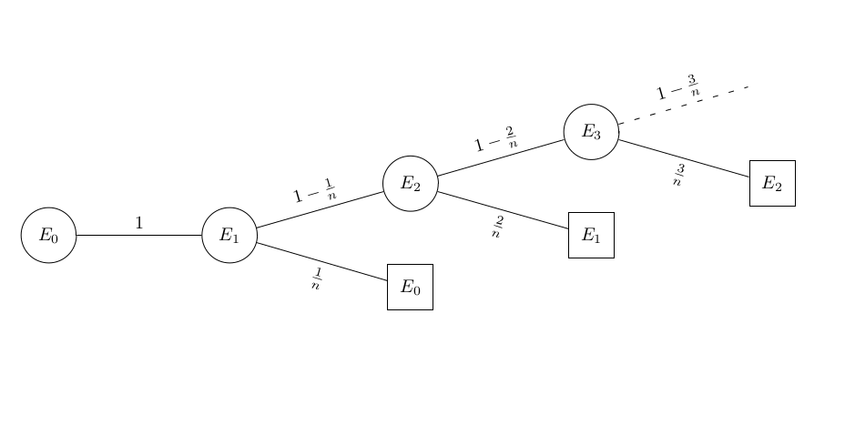

.. title: Average Number Of Switch Flips Required To Turn On All The Lights
.. slug: average-number-of-switch-flips-required-to-turn-on-all-the-lights
.. date: 2014-01-18 10:51:51 UTC+05:30
.. tags: mathjax
.. category: 
.. link: 
.. description: 
.. type: text

*Suppose there is an array of lights, initially all turned off, and during each step you randomly select a light and turn it on or off if it's in off or on state, respectively. On an average, how many steps are required to take it to all turned on state?*

This can be solved using an absorbing Markov chain, or by using a probability tree diagram.

In the method using the absorbing Markov chain, the starting state is for all turned off.
It can move to the next state which is for one random light turned on. The probability of moving to that state is 1.

From state 1, it can go back to state 0 with a probability of :math:`\dfrac{1}{n}`, or to state 2 with probability of :math:`1-\dfrac{1}{n}`.

And so on, in the :math:`(n-1)^{th}` state, it can go to the absorbing state n with a probability of \frac{1}{n}.

E.g. For :math:`n=6`, the matrix looks like this:

.. math::

    A=\left(\begin{array}{rrrrrrr}
    0 & 1 & 0 & 0 & 0 & 0 & 0 \\[10pt]
    \dfrac{1}{6} & 0 & \dfrac{5}{6} & 0 & 0 & 0 & 0 \\[10pt]
    0 & \dfrac{1}{3} & 0 & \dfrac{2}{3} & 0 & 0 & 0 \\[10pt]
    0 & 0 & \dfrac{1}{2} & 0 & \dfrac{1}{2} & 0 & 0 \\[10pt]
    0 & 0 & 0 & \dfrac{2}{3} & 0 & \dfrac{1}{3} & 0 \\[10pt]
    0 & 0 & 0 & 0 & \dfrac{5}{6} & 0 & \dfrac{1}{6} \\[10pt]
    0 & 0 & 0 & 0 & 0 & 0 & 1
    \end{array}\right)

Thus, the matrix Q is:

.. math::

    Q=\left(\begin{array}{rrrrrr}
    0 & 1 & 0 & 0 & 0 & 0 \\[10pt]
    \dfrac{1}{6} & 0 & \dfrac{5}{6} & 0 & 0 & 0 \\[10pt]
    0 & \dfrac{1}{3} & 0 & \dfrac{2}{3} & 0 & 0 \\[10pt]
    0 & 0 & \dfrac{1}{2} & 0 & \dfrac{1}{2} & 0 \\[10pt]
    0 & 0 & 0 & \dfrac{2}{3} & 0 & \dfrac{1}{3} \\[10pt]
    0 & 0 & 0 & 0 & \dfrac{5}{6} & 0
    \end{array}\right)

And the Expected number of steps is found from

.. math::

    (I-Q)^{-1} = \left(\begin{array}{rrrrrr}
    \dfrac{13}{5} & \dfrac{48}{5} & 21 & 26 & 18 & 6 \\[10pt]
    \dfrac{8}{5} & \dfrac{48}{5} & 21 & 26 & 18 & 6 \\[10pt]
    \dfrac{7}{5} & \dfrac{42}{5} & 21 & 26 & 18 & 6 \\[10pt]
    \dfrac{13}{10} & \dfrac{39}{5} & \dfrac{39}{2} & 26 & 18
    & 6 \\[10pt]
    \dfrac{6}{5} & \dfrac{36}{5} & 18 & 24 & 18 & 6 \\[10pt]
    1 & 6 & 15 & 20 & 15 & 6
    \end{array}\right)

The sum of first row gives the expected time it takes to move from the initial state to the absorbing state, which evaluates to :math:`\dfrac{416}{5} = 83.2` steps.

This markov chain can be used also to calculate the probability of being in a certain state after 'k' steps.

E.g. What is the probability of all 6 lights being turned on after random flipping of switches 8 times?

.. math::

    A^8=\left(\begin{array}{rrrrrrr}
    \dfrac{169}{4374} & 0 & \dfrac{1105}{2187} & 0 & \dfrac{815}{1944} & 0 & \dfrac{215}{5832} \\[10pt]
    0 & \dfrac{2717}{13122} & 0 & \dfrac{16175}{26244} & 0 & \dfrac{815}{5832} & \dfrac{215}{5832} \\[10pt]
    \dfrac{221}{6561} & 0 & \dfrac{12487}{26244} & 0 & \dfrac{931}{2187} & 0 & \dfrac{7}{108} \\[10pt]
    0 & \dfrac{3235}{17496} & 0 & \dfrac{10381}{17496} & 0 & \dfrac{5003}{34992} & \dfrac{919}{11664} \\[10pt]
    \dfrac{163}{5832} & 0 & \dfrac{931}{2187} & 0 & \dfrac{42613}{104976} & 0 & \dfrac{14741}{104976} \\[10pt]
    0 & \dfrac{815}{5832} & 0 & \dfrac{25015}{52488} & 0 & \dfrac{12595}{104976} & \dfrac{9227}{34992} \\[10pt]
    0 & 0 & 0 & 0 & 0 & 0 & 1
    \end{array}\right)

Answer is :math:`A^8[0,6] = \dfrac{215}{5832}`

We can construct the markov chain and calculate the expected value in Sagemath (a very promising free CAS) as follows:

.. code-block:: python
    :number-lines: 0

    n=6
    mx=[[0]*(n+1) for i in range(n+1)]
    mx[0][1]=1
    for i in range(1,n):
        mx[i][i-1]=i/n
        mx[i][i+1]=1-i/n
    mx[n][n]=1
    am=matrix(mx)
    print sum((identity_matrix(n)-am[0:n,0:n]).inverse()[0].list())

If we want to know only the expected value, we can use the tree method:

    Probability tree to calculate expected value

.. math::

    E_0=1\cdot(1+E_1)

.. math::

    E_1 = \dfrac{1}{n}\cdot(1+E_0)+\left(1-\dfrac{1}{n}\right)\cdot(1+E_2)

.. math::

    E_2=\dfrac{2}{n}\cdot(1+E_1)+\left(1-\dfrac{2}{n}\right)\cdot(1+E_3)

.. math::

    \vdots

.. math::

    E_{n-1}=\dfrac{n-1}{n}\cdot(1+E_{n-2})+\left(1-\dfrac{n-1}{n}\right)\cdot(1)

From the above set of equations, we can derive the following algorithm to calculate the expected value in Sage:

.. code-block:: python
    :number-lines: 0

    ax=1
    n=6
    summ=0
    i=0
    while i<n:
        ax=(ax*i+x)/(x-i)
        summ += ax
        i+=1
    print summ.subs(x=n)

As we see, the n is taken to be 6, and the answer returned is 416/5. The variable name is chosen as 'summ', since sum is a function's name. And, ax indicates a function of x.

For higher values of n, we get e.g.

:math:`n=32:`

.. math::

    \dfrac{20053487665674803216384}{4512611027925}\approx 4443876846.81

:math:`n=64:`

.. math::

    \dfrac{346357890987659686224886668704722715345420288}{18472920064106597929865025} \approx 18749493300771803147.7216833338
