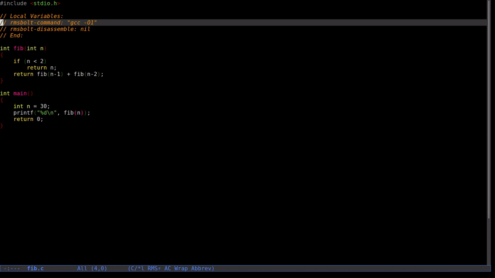

.. title: Interactive Disassembly
.. slug: interactive-disassembly
.. date: 2018-10-28 21:06:08 UTC+05:30
.. tags: emacs, godbolt, rmsbolt, GCC
.. link:
.. description:
.. type: text

`Godbolt <https://godbolt.org/>`_ enables us to interactively see the assembly output of the input source code by the selected compiler.

But it depends on nodejs and there's quite a delay between the modified input and the produced disassembly.

Enter `RMSBolt <https://gitlab.com/jgkamat/rmsbolt>`_, which is a package for emacs. It's much lighter, more powerful, and more interactive when compared to Godbolt, and perhaps the only alternative to Godbolt. Great way to learn assembly language, and fun too!

