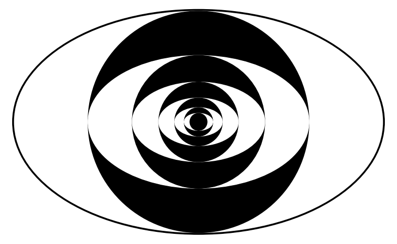
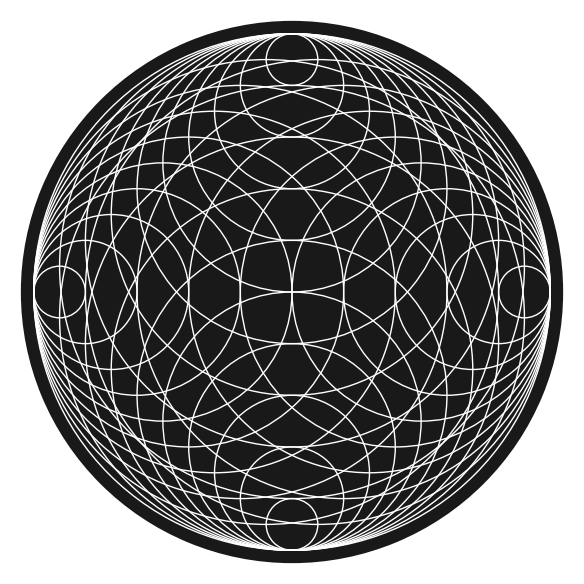
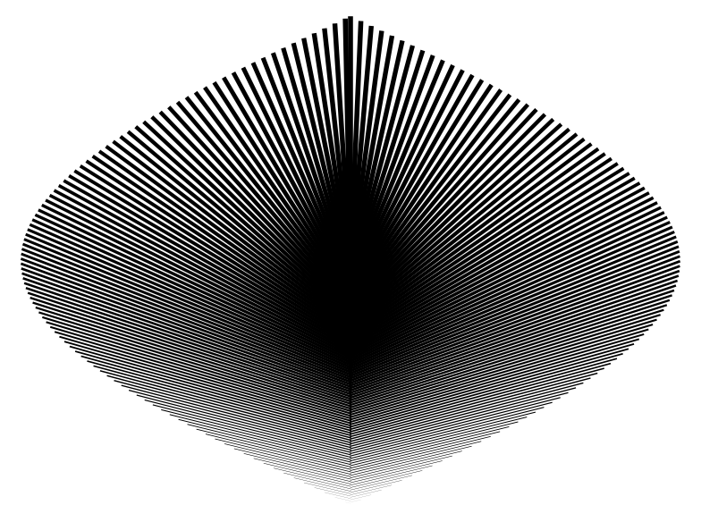
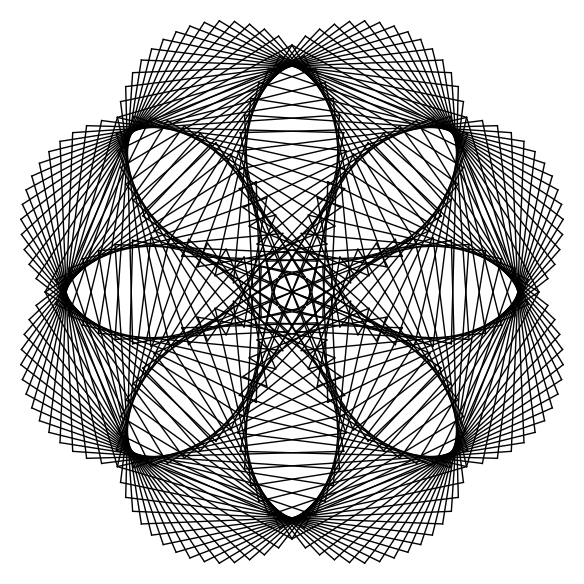
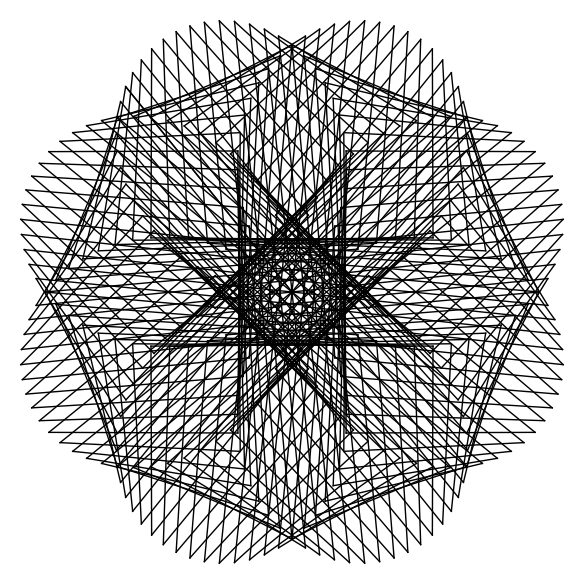

.. title: Interesting images - 2
.. slug: interesting-images-2
.. date: 2014-02-16 11:43:36 UTC+05:30
.. tags: mathjax, computer art, sage, recurrence
.. category: 
.. link: 
.. description: 
.. type: text

Let us command the computer to generate some more art!

Below is a modification from previous post. 

.. code-block:: python
    :number-lines: 1

    plt=Graphics()
    n = 5
    plt += ellipse((0,0),5.05,3.05,fill=1,color='black')
    for i in range(n+1):
        plt += ellipse((0,0),(3/5)^i*5,(3/5)^i*3,fill=1,color='white')
        plt += circle((0,0),(3/5)^i*3,color='black',fill=1)
    plt.show(frame=0,axes=0)

    Fractal eyes

.. code-block:: python
    :number-lines: 1

    plt=Graphics()
    n = 10
    for i in range(1,n+1):
        plt += circle((0,1-i/n),1-i/n,color='white')
        plt += circle((i/n,1),1-i/n,color='white')
        plt += circle((-i/n,1),1-i/n,color='white')
        plt += circle((0,2-i/n),i/n,color='white')
    plt += disk((0,1),1.05,(0,2*pi),color='black',alpha=0.9)
    plt.show(frame=0,axes=0)

    Circles!

.. code-block:: python
    :number-lines: 1

    plt=Graphics()
    n = 200
    for i in range(1,n+1):
        plt += line2d([(0,i/n),((-1)^i*sin(pi/n*i),2*i/n)],color='black',thickness=(i/n)*n/50)
    plt.show(frame=0,axes=0)

    What?

Some more, parametric plot using lines. Smooth edges are okay, few rough edges are a pain, many rough edges are soothing! 

.. code-block:: python
    :number-lines: 1

    def draw(a,b,d):
        d=d*pi/180
        plt=Graphics()
        nn = 360
        for i in range(nn+1):
            plt += line2d([(sin(a*i*d)*sin(b*i*d),cos(a*(i)*d)*sin(b*(i)*d)),(sin(a*(i+1)*d)*sin(b*(i+1)*d),cos(a*(i+1)*d)*sin(b*(i+1)*d))],color='black')
        plt.show(frame=0,axes=0,aspect_ratio=1)
    draw(3,4,11)

    :math:`d = 37`

    :math:`d = 107`

Change d to any other prime, also try changing a and b, there are many possibilities!
