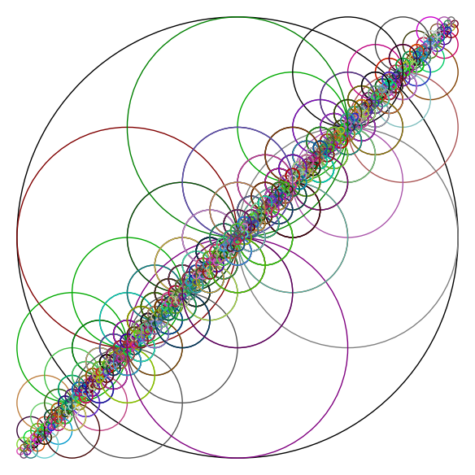
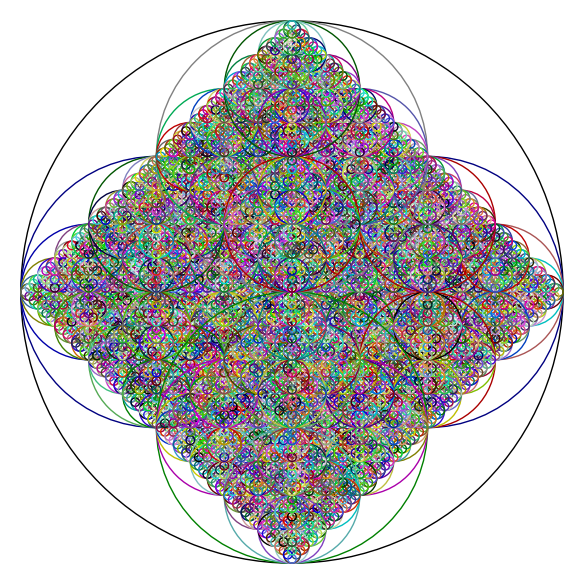
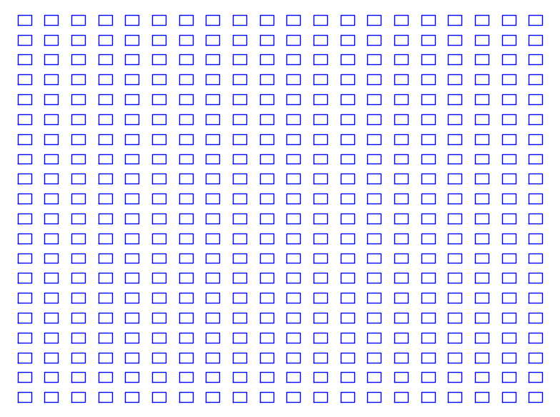
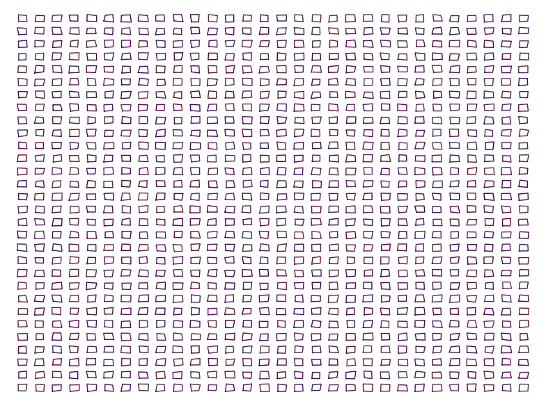

.. title: Interesting images using recurrences/iterations
.. slug: interesting-images-using-recurrencesiterations
.. date: 2014-02-14 10:54:56 UTC+05:30
.. tags: mathjax, computer art, recurrence, sage
.. category: 
.. link: 
.. description: 
.. type: text

Think of a simple figure. Now, think how it may look like if you repeat the same figure by placing it close to the original figure but smaller in size (e.g. by halving in size), and keep repeating.

Here are some snippets of code in Sage to use the idea using circles, experiment with it by changing the parameters/shape.

.. code-block:: python
    :number-lines: 1

    var('y')
    plt=Graphics()
    a=22
    b=22
    def doit(a,b,ra,cnt):
        global plt
        plt += circle((a,b),ra,color=(randint(0,cnt)/(1+cnt),randint(0,cnt)/(1+cnt),randint(0,cnt)/(1+cnt)))
        if cnt >5:
            return
        doit(a+ra/2,a,ra/2,cnt+1)
        doit(a-ra/2,a,ra/2,cnt+1)
        doit(a,a-ra/2,ra/2,cnt+1)
        doit(a,a+ra/2,ra/2,cnt+1)
    doit(0,0,22,0)    
    plt.show(frame=False,axes=0)  

    A saturn-like fractal

.. code-block:: python
    :number-lines: 1

    plt=Graphics()
    a=22
    b=22
    def doit(a,b,ra,cnt):
        global plt
        plt += circle((a,b),ra,color=(randint(0,cnt)/(1+cnt),randint(0,cnt)/(1+cnt),randint(0,cnt)/(1+cnt)))
        if cnt > 5:
            return
        doit(a+ra/2,b,ra/2,cnt+1)
        doit(a-ra/2,b,ra/2,cnt+1)
        doit(a,b-ra/2,ra/2,cnt+1)
        doit(a,b+ra/2,ra/2,cnt+1)
    doit(0,0,22,0)    
    plt.show(frame=False,axes=0)  

    Another fractal using circles

.. code-block:: python
    :number-lines: 1

    plt=Graphics()
    a=16*golden_ratio
    b=16
    k=a/b
    for i in range(11):
        plt += implicit_plot(x^2/a^2+y^2/b^2-1, (-a, a), (-a, a),color=(0,0,0))
        plt += implicit_plot(x^2/b^2+y^2/b^2-1, (-a, a), (-a, a),color=(.2,.2,.2))
        a = a/k
        b = b/k
    plt.show(frame=False,axes=0) 

.. figure:: ../../images/eyes1.png

    A fractal eye

The below two are from Knuth's TAOCP vol 2 -- a little bit of randomness is good!

.. code-block:: python
    :number-lines: 1

    plt=Graphics()
    for a in range(-20,20,2):
        for b in range(-20,20,2):
            plt += line([(a,b),(a+1,b),(a+1,b+1),(a,b+1),(a,b)])
    plt.show(frame=0,axes=0)    

    Regular tiles

.. code-block:: python
    :number-lines: 1

    plt=Graphics()
    def ran(): return random()*0.2-0.1
    for a in range(-20,40,2):
        for b in range(-20,40,2):
            x1=a+ran()
            y1=b+ran()
            plt += line([(x1,y1),(a+1+ran(),b+ran()),(a+1+ran(),b+1+ran()),(a+ran(),b+1+ran()),(x1,y1)],color=(ran()+0.3,ran()+0.1,ran()+0.3))
    plt.show(frame=0,axes=0)   

    Slightly randomized tiles
